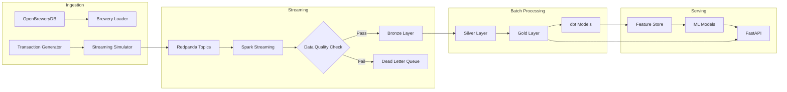
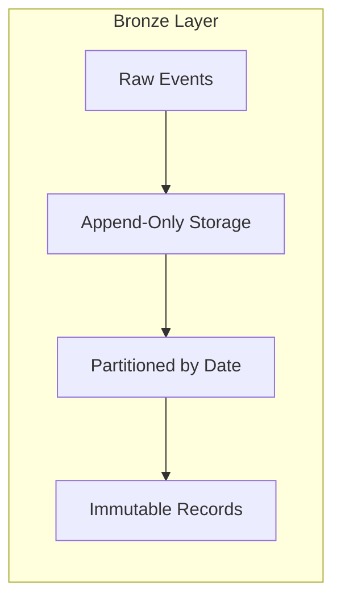
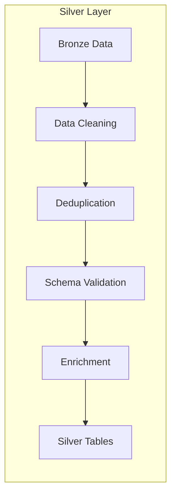
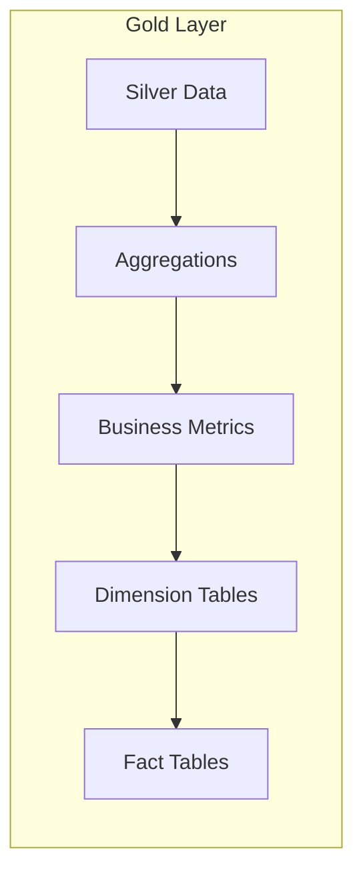
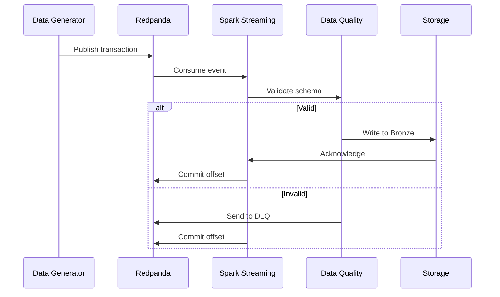
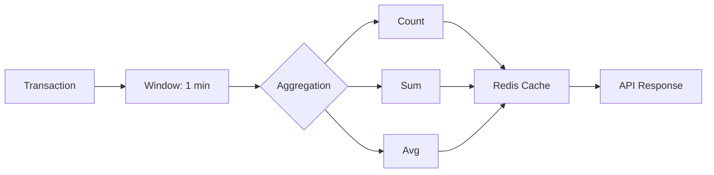
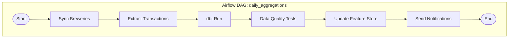
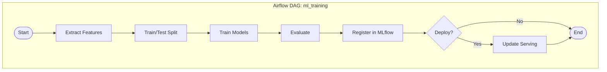
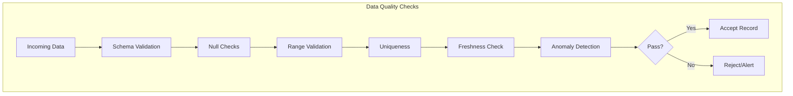
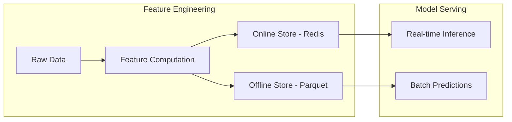

# Data Flow

This document describes how data flows through the TapFlow platform, from ingestion to serving.

## Data Pipeline Overview

## Medallion Architecture

TapFlow implements the medallion (multi-hop) architecture pattern:

### Bronze Layer (Raw)

**Characteristics:**
- Raw data exactly as received
- Append-only, immutable
- Partitioned by ingestion date
- Schema-on-read
- Full history retained

**Tables:**
| Table | Description | Partition Key |
|-------|-------------|---------------|
| `raw_transactions` | Sales transactions | `ingestion_date` |
| `raw_breweries` | Brewery metadata | `ingestion_date` |
| `raw_events` | System events | `ingestion_date` |

### Silver Layer (Validated)

**Characteristics:**
- Cleaned and validated
- Deduplicated records
- Strongly typed schemas
- Business keys applied
- Incremental updates

**Tables:**
| Table | Description | Update Frequency |
|-------|-------------|------------------|
| `transactions` | Validated sales | Real-time |
| `breweries` | Enriched brewery data | Daily |
| `inventory` | Current stock levels | Real-time |

### Gold Layer (Business-Ready)

**Characteristics:**
- Business-level aggregations
- Optimized for queries
- Star schema design
- Pre-computed metrics
- SLA-bound freshness

**Tables:**
| Table | Description | Grain |
|-------|-------------|-------|
| `daily_sales_summary` | Daily sales by brewery/beer | Day |
| `hourly_metrics` | Hourly transaction metrics | Hour |
| `inventory_snapshots` | Point-in-time inventory | Hour |
| `brewery_performance` | KPIs by brewery | Day |

## Streaming Data Flow

### Transaction Processing

### Real-Time Metrics

## Batch Processing Flow

### Daily Aggregation DAG

### ML Training Pipeline

## Data Quality Framework

### Quality Checks

### Quality Metrics

| Metric | Threshold | Action on Breach |
|--------|-----------|------------------|
| Schema validity | 100% | Reject record |
| Null rate | <5% | Warning |
| Duplicates | 0% | Deduplicate |
| Freshness | <2 hours | Alert |
| Anomaly score | <3σ | Flag for review |

## Feature Store Integration

## Data Retention Policy

| Layer | Retention | Storage Format |
|-------|-----------|----------------|
| Bronze | 90 days | Parquet |
| Silver | 1 year | Parquet |
| Gold | 2 years | Parquet |
| Cache | 24 hours | Redis |
| MLflow | Indefinite | SQLite + Artifacts |

## Related Documentation

- [System Architecture](./system-architecture.md) - Component overview
- [API Endpoints](../api/endpoints.md) - Data access patterns
- [Troubleshooting](../setup/troubleshooting.md) - Data pipeline issues
