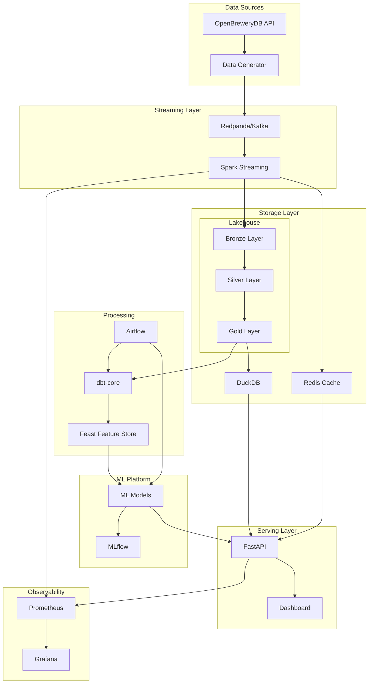
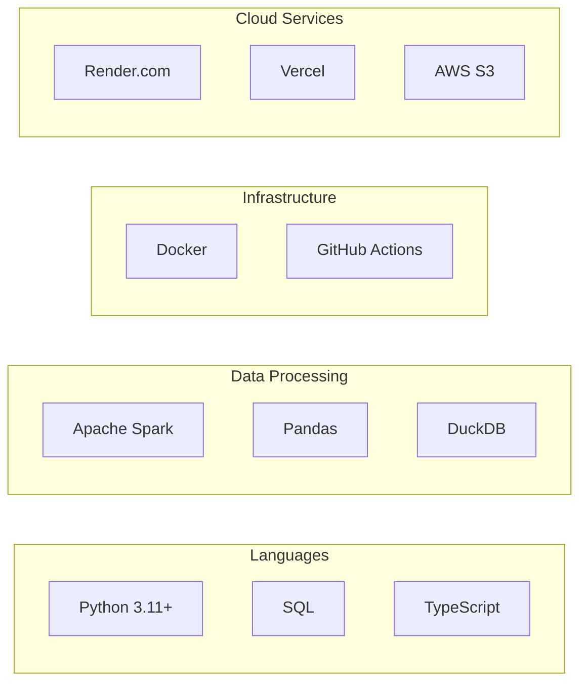

# System Architecture

TapFlow is a production-grade data engineering platform for real-time brewery analytics. This document describes the system architecture and component interactions.

## Architecture Overview

## Component Descriptions

### Data Sources

| Component | Description |
|-----------|-------------|
| **OpenBreweryDB API** | Public API providing real brewery data (names, locations, types) |
| **Data Generator** | Synthetic transaction generator creating realistic sales data |

### Streaming Layer

| Component | Technology | Purpose |
|-----------|------------|---------|
| **Message Broker** | Redpanda (Kafka-compatible) | Event streaming with sub-millisecond latency |
| **Stream Processor** | Spark Structured Streaming | Real-time aggregations and transformations |

### Storage Layer

| Layer | Description | Update Frequency |
|-------|-------------|------------------|
| **Bronze** | Raw, immutable data as received | Real-time |
| **Silver** | Cleaned, validated, deduplicated | Near real-time |
| **Gold** | Business-ready aggregations | Hourly/Daily |
| **Redis** | Hot data cache for API responses | Real-time |
| **DuckDB** | Analytical queries on processed data | On-demand |

### Processing

| Component | Technology | Purpose |
|-----------|------------|---------|
| **Orchestration** | Apache Airflow | DAG scheduling and monitoring |
| **Transformation** | dbt-core | SQL-based data transformations |
| **Feature Store** | Feast | ML feature management and serving |

### ML Platform

| Component | Technology | Purpose |
|-----------|------------|---------|
| **Experiment Tracking** | MLflow | Model versioning and metrics |
| **Models** | scikit-learn, Prophet | Demand forecasting, anomaly detection |

### Serving Layer

| Component | Technology | Purpose |
|-----------|------------|---------|
| **API** | FastAPI | REST endpoints for data access |
| **Dashboard** | React/Next.js | Real-time visualization |

### Observability

| Component | Technology | Purpose |
|-----------|------------|---------|
| **Metrics** | Prometheus | Time-series metrics collection |
| **Visualization** | Grafana | Dashboards and alerting |

## Technology Stack Summary

## Service Ports

| Service | Port | URL |
|---------|------|-----|
| FastAPI | 8000 | http://localhost:8000/docs |
| Airflow | 8080 | http://localhost:8080 |
| Grafana | 3000 | http://localhost:3000 |
| Redpanda Console | 8081 | http://localhost:8081 |
| Prometheus | 9090 | http://localhost:9090 |
| Redis | 6379 | - |

## Design Principles

1. **Modularity** - Each component is independently deployable
2. **Scalability** - Horizontal scaling through containerization
3. **Observability** - Comprehensive metrics and logging
4. **Reproducibility** - Infrastructure as Code with Docker
5. **Data Quality** - Validation at every layer

## Related Documentation

- [Data Flow](./data-flow.md) - Detailed data pipeline documentation
- [Local Development](../setup/local-development.md) - Setup instructions
- [API Endpoints](../api/endpoints.md) - API reference
