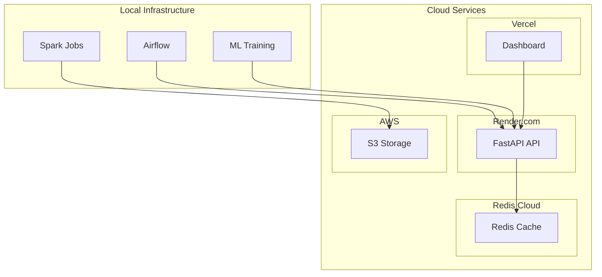

# Deployment Guide

This guide covers deploying TapFlow to production using a hybrid free-tier approach.

## Deployment Architecture



## Platform Overview

| Component | Platform | Tier | Limits |
|-----------|----------|------|--------|
| API | Render.com | Free | 750 hrs/month |
| Dashboard | Vercel | Hobby | Unlimited |
| Storage | AWS S3 | Free | 5GB |
| Cache | Redis Cloud | Free | 30MB |

## API Deployment (Render)

### Prerequisites

1. [Render account](https://render.com)
2. GitHub repository connected
3. Environment variables configured

### Setup Steps

#### 1. Create Web Service

1. Go to Render Dashboard → **New** → **Web Service**
2. Connect your GitHub repository
3. Configure service:

| Setting | Value |
|---------|-------|
| Name | `tapflow-api` |
| Region | Oregon (US West) |
| Branch | `main` |
| Root Directory | `.` |
| Runtime | Docker |
| Dockerfile Path | `docker/api/Dockerfile` |

#### 2. Configure Environment Variables

Add these environment variables in Render:

```
ENVIRONMENT=production
API_HOST=0.0.0.0
API_PORT=10000
REDIS_HOST=<your-redis-cloud-host>
REDIS_PORT=<your-redis-cloud-port>
REDIS_PASSWORD=<your-redis-cloud-password>
DUCKDB_PATH=/data/tapflow.duckdb
LOG_LEVEL=INFO
```

#### 3. Configure Health Check

| Setting | Value |
|---------|-------|
| Health Check Path | `/health` |
| Health Check Interval | 30 seconds |

#### 4. Deploy

Click **Create Web Service**. Render will:
1. Clone your repository
2. Build the Docker image
3. Deploy the container
4. Provide a URL: `https://tapflow-api.onrender.com`

### GitHub Actions Integration

The repository includes automated deployment via `.github/workflows/deploy-api.yml`:

```yaml
# Triggered on push to main affecting API files
# Requires secrets:
#   - RENDER_DEPLOY_HOOK_URL
```

To set up:
1. In Render, go to Service → Settings → Deploy Hook
2. Copy the deploy hook URL
3. Add as GitHub secret: `RENDER_DEPLOY_HOOK_URL`

## Dashboard Deployment (Vercel)

### Prerequisites

1. [Vercel account](https://vercel.com)
2. GitHub repository connected

### Setup Steps

#### 1. Import Project

1. Go to Vercel Dashboard → **Add New** → **Project**
2. Import your GitHub repository
3. Configure project:

| Setting | Value |
|---------|-------|
| Framework Preset | Next.js |
| Root Directory | `dashboard` |
| Build Command | `npm run build` |
| Output Directory | `.next` |

#### 2. Configure Environment Variables

```
NEXT_PUBLIC_API_URL=https://tapflow-api.onrender.com
NEXT_PUBLIC_ENVIRONMENT=production
```

#### 3. Deploy

Click **Deploy**. Vercel will:
1. Build the Next.js application
2. Deploy to edge network
3. Provide URL: `https://tapflow.vercel.app`

### GitHub Actions Integration

The repository includes automated deployment via `.github/workflows/deploy-dashboard.yml`:

```yaml
# Triggered on push to main affecting dashboard files
# Requires secrets:
#   - VERCEL_TOKEN
#   - VERCEL_ORG_ID
#   - VERCEL_PROJECT_ID
```

To get these values:
```bash
# Install Vercel CLI
npm i -g vercel

# Link project (creates .vercel/project.json)
cd dashboard
vercel link

# Get token from Vercel settings
# https://vercel.com/account/tokens
```

## Redis Cloud Setup

### Create Free Instance

1. Go to [Redis Cloud](https://redis.com/try-free/)
2. Create free database:
   - Cloud: AWS
   - Region: us-east-1
   - Plan: Free (30MB)

3. Note connection details:
   - Host: `redis-xxxxx.c1.us-east-1-1.ec2.cloud.redislabs.com`
   - Port: `xxxxx`
   - Password: `your-password`

### Configure in Render

Add Redis connection to Render environment:
```
REDIS_HOST=redis-xxxxx.c1.us-east-1-1.ec2.cloud.redislabs.com
REDIS_PORT=xxxxx
REDIS_PASSWORD=your-password
```

## AWS S3 Setup (Optional)

For storing processed data and ML artifacts:

### Create Bucket

```bash
aws s3 mb s3://tapflow-data-lake --region us-east-1
```

### Configure CORS

```json
{
    "CORSRules": [
        {
            "AllowedOrigins": ["https://tapflow.vercel.app"],
            "AllowedMethods": ["GET"],
            "AllowedHeaders": ["*"]
        }
    ]
}
```

### IAM Policy

Create limited-access IAM user:

```json
{
    "Version": "2012-10-17",
    "Statement": [
        {
            "Effect": "Allow",
            "Action": [
                "s3:GetObject",
                "s3:PutObject",
                "s3:ListBucket"
            ],
            "Resource": [
                "arn:aws:s3:::tapflow-data-lake",
                "arn:aws:s3:::tapflow-data-lake/*"
            ]
        }
    ]
}
```

## Deployment Checklist

### Pre-Deployment

- [ ] All tests passing (`make test`)
- [ ] Code formatted (`make format`)
- [ ] Environment variables documented
- [ ] Secrets added to GitHub
- [ ] Health check endpoint working

### Post-Deployment

- [ ] API health check passing
- [ ] Dashboard loading correctly
- [ ] Redis connection verified
- [ ] Monitoring alerts configured
- [ ] SSL certificates active

## Monitoring Production

### Health Endpoints

```bash
# API health
curl https://tapflow-api.onrender.com/health

# API metrics
curl https://tapflow-api.onrender.com/metrics
```

### Logs

- **Render**: Dashboard → Service → Logs
- **Vercel**: Dashboard → Project → Deployments → Functions

### Alerts

Configure alerts in Render for:
- Service restart
- Health check failures
- High memory usage

## Rollback

### Render

1. Go to Service → Events
2. Find previous successful deploy
3. Click **Rollback**

### Vercel

1. Go to Deployments
2. Find previous deployment
3. Click **...** → **Promote to Production**

## Cost Optimization

### Free Tier Limits

| Service | Limit | Mitigation |
|---------|-------|------------|
| Render | 750 hrs/month | Service sleeps after inactivity |
| Vercel | 100GB bandwidth | Edge caching |
| Redis Cloud | 30MB | TTL on cached data |
| S3 | 5GB | Data lifecycle policies |

### Render Sleep Prevention

The free tier sleeps after 15 minutes of inactivity. Options:
1. Accept cold starts (~30s)
2. Use external ping service
3. Upgrade to paid tier ($7/month)

## Related Documentation

- [Local Development](./local-development.md) - Development setup
- [Troubleshooting](./troubleshooting.md) - Deployment issues
- [System Architecture](../architecture/system-architecture.md) - Overview
